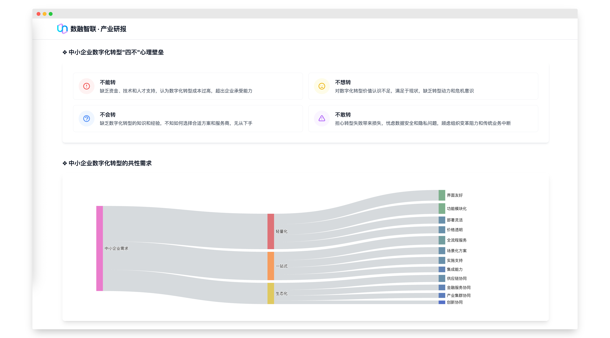

# 中小企业数字化转型研究报告



## 项目介绍

本项目是一个关于中小企业数字化转型的研究报告网站，旨在展示中小企业在数字化转型过程中的痛点、需求与未来市场空间机会。通过清晰的数据可视化和深入的行业分析，为读者提供全面的市场洞察。

## 主要内容

- 数字化转型概述与背景
- 中小企业数字化现状分析
- 行业政策与发展环境
- 不同行业数字化转型案例
- 数字化转型面临的挑战与解决方案
- 未来五年市场空间预测
- 投资建议与发展策略

## 技术栈

- HTML5
- CSS3 (使用Tailwind CSS框架)
- JavaScript (原生)
- 响应式设计
- 数据可视化

## 快速开始

由于项目使用CDN引入依赖，无需安装任何依赖包，直接克隆仓库后用浏览器打开index.html即可运行：

```bash
# 克隆仓库
git clone https://github.com/im-286/250419szhzx.git

# 进入项目目录
cd 250419szhzx

# 使用浏览器打开
open index.html

## 项目结构
```plaintext
250419szhzx/
├── index.html          # 主页面
├── styles.css          # 样式文件
├── scripts.js          # 交互脚本
├── chart-utils.js      # 图表工具函数
├── images/             # 图片资源目录
├── PDF/                # PDF文档目录
├── LICENSE             # 开源协议
└── README.md           # 项目说明
 ```

## 浏览器兼容性
- Chrome (推荐)
- Firefox
- Safari
- Edge
## 贡献指南
欢迎对本项目提出改进建议或直接贡献代码。请遵循以下步骤：

1. Fork 本仓库
2. 创建你的特性分支 ( git checkout -b feature/AmazingFeature )
3. 提交你的更改 ( git commit -m 'Add some AmazingFeature' )
4. 推送到分支 ( git push origin feature/AmazingFeature )
5. 开启一个 Pull Request

## 许可证
本项目采用 MIT 许可证 - 详情请参阅 LICENSE 文件

## 致谢
- 感谢所有为本项目提供数据支持和研究资料的机构与个人
- 特别感谢为项目提供技术支持的开源社区